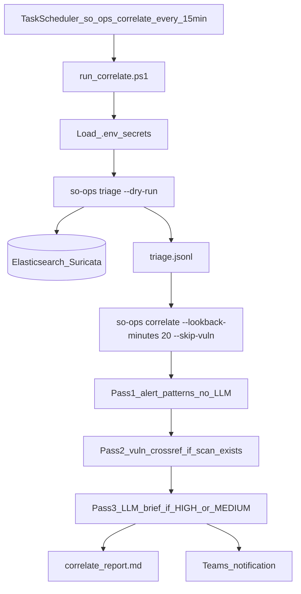

# 15-Minute Check — Team Guide

Every **15 minutes**, a Windows scheduled task pulls new Security Onion alerts, classifies them with fast rule-based logic (no LLM), looks for attack **patterns** across those alerts, and posts a Teams message when something worth investigating is found. This guide explains what runs, where output goes, and how to troubleshoot.

**This is not "every 15 alerts."** It is a timer that fires every 15 minutes.

---

## What it does (one paragraph)

Task Scheduler runs `run_correlate.ps1`, which executes two commands back-to-back:

1. **`so-ops triage --dry-run`** — query Elasticsearch for new Suricata alerts, classify with rules only, append results to `triage.jsonl`
2. **`so-ops correlate --lookback-minutes 20 --skip-vuln`** — read the last 20 minutes of `triage.jsonl`, detect behavioural patterns, write a report, and notify Teams if HIGH/MEDIUM findings exist (vuln scan cross-reference skipped)

**What it does not do:** full LLM triage (`so-ops triage` without `--dry-run`), daily health reports (`so-ops health`), or weekly vulnerability scans (`so-ops scan`).

---

## Visual flow



---

## How it starts

| Item | Value |
|------|-------|
| Task name | `so-ops-correlate` |
| Schedule | Every 15 minutes |
| Script | `C:\CBScripts\so-ops\run_correlate.ps1` |
| Secrets | Loaded from `C:\CBScripts\so-ops\.env` (never committed to git) |
| Config | `C:\CBScripts\so-ops\config.toml` via `SO_OPS_CONFIG` |

The script sets environment variables from `.env`, then runs the two `so-ops` commands in order.

---

## Step 1: `so-ops triage --dry-run`

**Purpose:** Get new alerts from Security Onion and write a structured log that correlate can read.

| Step | What happens |
|------|----------------|
| Query ES | Fetches **Suricata alerts** from `logs-suricata.alerts-so` since the triage cursor |
| Auto-noise | Known benign signatures (STUN, Microsoft connection test, etc.) → `NOISE` immediately |
| Classify | **Rule-based only** — Suricata severity (1=HIGH, 2=MEDIUM, 3=LOW) plus escalation rules and flow correlation. **No LLM call** |
| Write | Each result appended to `C:/CBScripts/so-ops-data/logs/triage.jsonl` |
| Skip | Does **not** advance the triage cursor; does **not** send triage notifications |

**Data sources:**

- **Suricata alerts** — main pipeline; every line in `triage.jsonl` comes from here
- **Sigma detections** — fetched for the summary report only; **not** written to `triage.jsonl` and **not** seen by correlate
- **Zeek** — not used in this job (only in the daily health report)

**Dry-run classification methods** (field `method` in `triage.jsonl`):

| Method | Meaning |
|--------|---------|
| `auto` | Matched auto-noise signature |
| `rule-severity` | Verdict from Suricata severity alone |
| `rule-escalated` | Escalation rules bumped the verdict (e.g. ET SCAN → MEDIUM) |
| `rule-correlated` | Another rule on the same network flow triggered escalation |
| `needs-llm` | Low severity; full triage would ask the LLM to confirm or downgrade |

---

## Step 2: `so-ops correlate --lookback-minutes 20 --skip-vuln`

**Purpose:** Find attack **patterns** across multiple alerts, not just single-alert severity.

The **20-minute window** is intentional: the job runs every 15 minutes, so the extra 5 minutes of overlap catches alerts that span a boundary between runs.

### Pass 1 — Alert pattern detection (no LLM)

Reads `triage.jsonl` and runs 14 rule-based behavioural checks in `correlate_patterns.py`:

| Pattern | Confidence | What triggers it |
|---------|------------|------------------|
| Scan→exploit chain | HIGH | Same source IP fires both SCAN and exploit/trojan/malware rules |
| Host targeted | HIGH | Same destination hit by both scan and exploit rules |
| Inbound sweep | HIGH | External IP reaches 4+ internal hosts |
| Internal exploit | HIGH | Internal source → internal dest with high-severity rules |
| C2 / beaconing | HIGH | 3+ distinct TROJAN/MALWARE rules on same source→dest pair |
| Lateral movement | MEDIUM | One source reaches 4+ distinct internal destinations |
| Port sweep | MEDIUM | Same source hits the same port on 3+ different hosts |
| Multi-rule pair | MEDIUM | 4+ distinct rules on the same source→dest pair |
| Brute force | MEDIUM | 10+ alerts on auth ports (SSH, RDP, SMB, etc.) for same pair |
| High-volume source | MEDIUM/LOW | 30+ alerts from one source (scaled for short windows) |
| Single-rule flood | MEDIUM/LOW | Same rule fired 100+ times from one source (scaled for short windows) |
| Source IP pivot | LOW | Shared source across 5+ alerts in 3+ non-INFO categories |
| Destination IP pivot | LOW | Shared destination hit by 5+ rules from 2+ sources |
| Destination port pivot | LOW | Same port targeted by 3+ sources with 5+ alerts |

Auth ports used for brute-force detection: 21, 22, 23, 110, 143, 389, 445, 1433, 3306, 3389, 5432, 5900, 5984, 5985, 5986.

Some patterns skip IPs/ports already flagged by a higher-confidence pattern (e.g. inbound sweep is skipped if scan→exploit already matched that source).

### Pass 2 — Vulnerability cross-reference (optional)

Skipped when `--skip-vuln` is passed, or when no weekly `so-ops scan` output exists on disk.

Match types (highest confidence first): exact CVE in rule name → nuclei CVE confirmation → service keyword → targeted host with known CVEs.

### Pass 3 — LLM analyst brief

Only runs when Pass 1 or Pass 2 produce **HIGH or MEDIUM** findings. Sends a prioritised summary to Gemini (via OpenRouter). Internal IPs are scrubbed to `INT-001` / `EXT-001` tokens before the cloud call.

If the LLM call fails, the report and notifications still go out — just without the AI summary block.

### Notifications

Teams is notified when any of these are true:

- HIGH-confidence pattern detected
- MEDIUM-confidence pattern detected
- Vuln correlation recommends a verdict upgrade

The message contains the AI brief (if available) plus pattern details. If nothing meets that bar, **no Teams message is sent** — that is normal on a quiet network.

---

## Where to look

| Artifact | Path | When to use it |
|----------|------|----------------|
| Triage audit log | `C:/CBScripts/so-ops-data/logs/triage.jsonl` | Raw per-alert verdicts (one JSON object per line) |
| Correlate report | `C:/CBScripts/so-ops-data/output/correlate/report_*.md` | Full run summary + AI analyst brief |
| Correlate findings | `C:/CBScripts/so-ops-data/logs/correlate_findings.jsonl` | Machine-readable pattern/vuln findings |
| Triage log | `C:/CBScripts/so-ops-data/logs/triage.log` | Debug triage failures |
| Correlate log | `C:/CBScripts/so-ops-data/logs/correlate.log` | Debug correlate failures |
| Run state | `C:/CBScripts/so-ops-data/state/triage.json` and `correlate.json` | Last run times and cursors |
| Teams | Power Automate webhook (configured in `config.toml`) | What analysts see in chat |

Check last run times from the command line:

```powershell
so-ops status
```

---

## Glossary

| Term | Meaning |
|------|---------|
| **Triage verdict** | NOISE / LOW / MEDIUM / HIGH assigned to a single alert in Step 1 |
| **Pattern confidence** | high / medium / low — how sure correlate is about a *behavioural* pattern (separate from triage verdict) |
| **recommended_verdict** | What correlate thinks an analyst should treat the pattern as (HIGH, MEDIUM, etc.) |
| **pivot_ip** | The IP correlate centres the pattern on (usually the attacker or target) |
| **community_id** | Suricata flow hash — links alerts that belong to the same network connection |
| **Dry run** | Triage without LLM; used by the scheduled job for speed and cost |

---

## Manual commands

```powershell
# Run the same job the scheduler runs
Start-ScheduledTask -TaskName "so-ops-correlate"

# Or run the script directly
C:\CBScripts\so-ops\run_correlate.ps1

# Check when the task last ran
Get-ScheduledTaskInfo -TaskName "so-ops-correlate"

# Check so-ops tool state
so-ops status

# Run just triage or correlate individually
so-ops triage --dry-run
so-ops correlate --lookback-minutes 20 --skip-vuln
```

Environment variables must be set (the script loads them from `.env` automatically):

- `SO_OPS_ES_PASSWORD` — Elasticsearch password
- `SO_OPS_OR_API_KEY` — OpenRouter API key (for correlate LLM brief)
- `SO_OPS_CONFIG` — path to `config.toml`

---

## Troubleshooting

| Symptom | Likely cause | What to do |
|---------|--------------|------------|
| `No triage log found` | `triage.jsonl` does not exist yet | Run `so-ops triage --dry-run` once manually |
| `No triage alerts in the last 20m` | Quiet network or no new alerts in window | Normal — no Teams message expected |
| Elasticsearch connection error | Wrong password or firewall | Check `SO_OPS_ES_PASSWORD` in `.env`; verify SO firewall allows this machine on port 9200 |
| No Teams message | No HIGH/MEDIUM patterns this run | Normal on quiet runs — check `report_*.md` to confirm |
| LLM brief missing from report | No HIGH/MEDIUM findings, or OpenRouter error | Check `correlate.log` for LLM errors; verify `SO_OPS_OR_API_KEY` |
| Same alerts appearing repeatedly in `triage.jsonl` | Dry-run does not advance the triage cursor | Expected behaviour; correlate's 20-minute window limits how far back it analyses |
| Pass 2 always skipped | No vuln scan output on disk | Run `so-ops scan` on schedule (weekly) |

---

## What runs separately

| Job | When | Command |
|-----|------|---------|
| **15-minute check** (this guide) | Every 15 min | `run_correlate.ps1` |
| Full LLM triage | Manual only | `so-ops triage` (no `--dry-run`) |
| Daily health report | Daily | `so-ops health` |
| Vulnerability scan | Weekly (nmap / nuclei) | `so-ops scan` |

---

## Related files in the repo

| File | Role |
|------|------|
| `run_correlate.ps1` | Scheduled task entry point |
| `src/so_ops/tools/triage.py` | Triage logic (dry-run path) |
| `src/so_ops/tools/correlate.py` | Correlate orchestrator |
| `src/so_ops/tools/correlate_patterns.py` | Pass 1 pattern detection |
| `src/so_ops/tools/correlate_vuln.py` | Pass 2 vuln cross-reference |
| `src/so_ops/tools/correlate_report.py` | Pass 3 report + LLM brief |
| `config.toml` | Hosts, paths, notifications, escalation rules |
